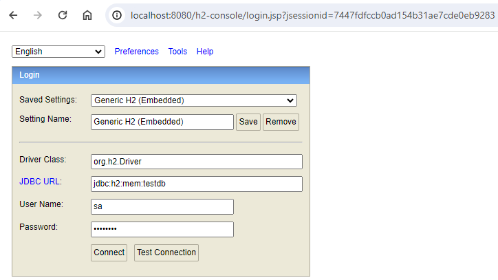
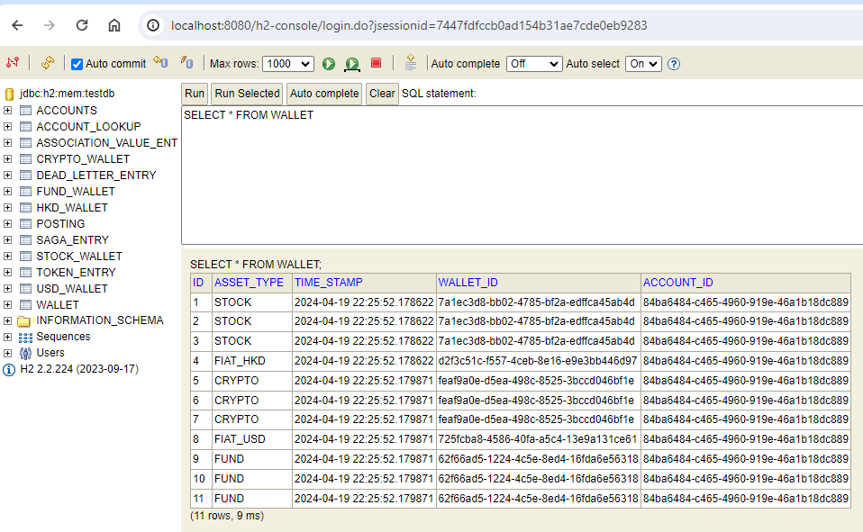

# accounting-ledger

accounting-ledger is a microservice which perform ledger posting operations. I wrote this application by implementing the Event Sourcing and CQRS design pattern.

## Tools & Technologies
* JDK 17
* Springboot 3.2.4
* Axon dependency version 4.9.3
* H2 In-Memory database
* Maven

## Prerequisites
* Installation of the JDK 17
* Maven 3.6.3 or above
* Download Axon Server as a zip https://www.axoniq.io/download
* Postmand to run APIs

## How to Run
* Checkout this accounting-ledger repository using Gitbash, Git Desktop or any other competent tool.
* Running Axon Server in local system :
    * Unzip the AxonServer.
    * Run below java command to run it
      
        **java -jar axonserver**
* To run with an appropriate IDE
  Run the com.cg.account.AccountingServiceApplication
* One can run maven command 

  **mvn clean -package**
* The above command generate the jar file, you can run this jar file.


## Initialization
* When this application will run at the initialization time it create an Account with Wallets with below Assets
  * Fiat Currency : HKD with initial balance $1000.0
  * Fiat Currency : USD with initial balance $1000.0
  * Crypto : BTC with initial balance 0.0
  * Stock : CAPGEMINI with initial balance 0
  * FundName : HSBC_SMALL_CAP with initial balance o.0
* Account object get initialized with default AccountStatus OPEN. Below status been considered
  * OPEN,
  * HOLD,
  * CLOSED
  * RELEASE 
    
## APIS
* To change the account status 
  * Endpoint : /api/accounts/{accountId}/status
  * Request Method : PATCH
  * RequestBody : accountStatus : "AccountStatus"  ex. { "accountStatus" : "HOLD" }
* Create Posting
  * Endpoint : /api/accounts/{accountId}/posting
  * Request Method : POST
  * RequestBody : 
  
    ```json
    [{
        "fromWalletId" : "bc15da8c-e831-4d8b-93bf-4f0daf0fc089",
        "toWalletId" : "f4808132-599e-428c-a1d9-d9eaff6c692c",
        "txnAmount" : 100.0
    },
    {
        "fromWalletId" : "f4808132-599e-428c-a1d9-d9eaff6c692c",
        "toWalletId" : "bc15da8c-e831-4d8b-93bf-4f0daf0fc089",
        "txnAmount" : 500.0
    },
     {
        "fromWalletId" : "bc15da8c-e831-4d8b-93bf-4f0daf0fc089",
        "toWalletId" : "f4808132-599e-428c-a1d9-d9eaff6c692c",
        "txnAmount" : 200.0
    },
    {
        "fromWalletId" : "f4808132-599e-428c-a1d9-d9eaff6c692c",
        "toWalletId" : "bc15da8c-e831-4d8b-93bf-4f0daf0fc089",
        "txnAmount" : 300.0
    }]
* Since we are using the H2 In memory database, one can get the accountId, fromWalletId and toWalletId from the DB tables.
  
  Once the application run you can access it : localhost:8080/h2-console/
  JDBC URL : jdbc:h2:mem:testdb
  User name : sa
  Password : password
  gi
## Assumptions
* This ledger will perform the transaction from one Asset to another Asset of the same account.
* If an Account's status is OPEN then only postings allowed.
* Although multiple Fiat Currencies can be involved but for this code I have considered below Fiat Currency
  * HKD
  * USD
* Considered only below Crypto Assets
  * BTC,
  * ETH,
  * SHIB
* Considered fictitious Fund types like below:
  * HSBC_SMALL_CAP
  * AIA_MID_CAP
  * CITI_LARGE_CAP
* Considered fictitious Stocks like below:
  * CAPGEMINI
  * HSBC
  * CITI
* Stock, Crypto and Fund assets can be moved to HKD or USD.
* USD and HKD can be moved from each other wallets as well.
* All Funds, Stocks and Crypto rate is hardcoded in HKD and USD
* HKD to USD and USD to HKD rate is also hardcoded.
* While performing the posting It will start with the PENDING PostingStatus, while processing the posting if its successful then it will change the status to "CLEARED" and update the WalletBalance. If failed then update the posting with the "FAILED" status and WalletBalance will not be updated. 

## Validation
I have implemented below validations using the Interceptor of the Commands
* If accountId already exist new account for the same accountId can't be created
* While Changing the account status, if accountId didn't exist then it will not perform the change account status and throw exception
* While performing the posting:
  * If Account exist with the provided accountId then validate the AccountStatus if it's not Open then it will not allow to perform the posting operation
  * If the provided accountId and fromWallet, accountId and toWallet not exist then it will not move further to process posting and throw exception.